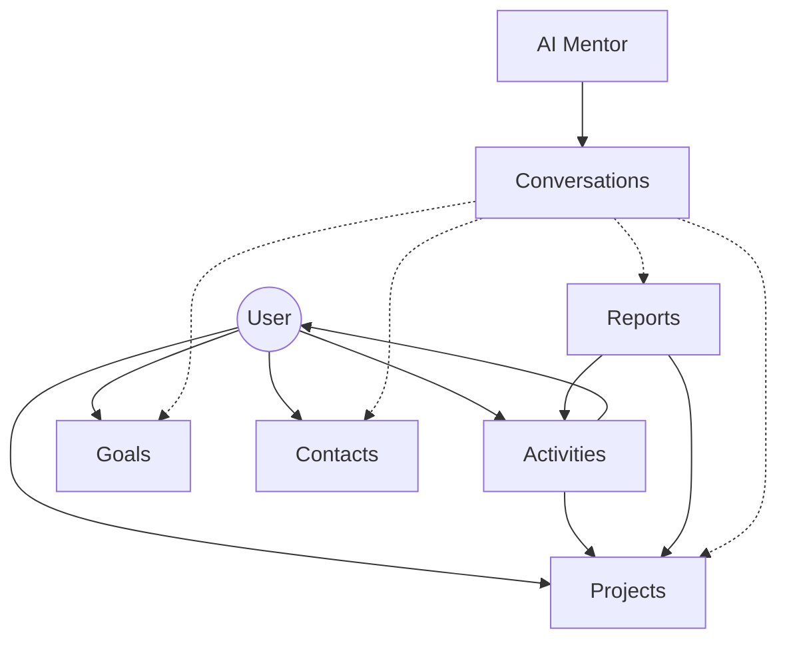

# jobmark Project Memory

## Overview

jobmark is a personal career management platform that allows users to log accomplishments ("activities"), track projects, set goals, and manage professional networks with AI-powered insights and mentor interactions.

## Architecture & Tech Stack

- **Framework:** Next.js 16 (App Router)
- **Language:** TypeScript
- **Database:** PostgreSQL via Prisma ORM
- **Auth:** Auth.js (NextAuth) with Google Provider
- **UI:** Tailwind CSS, Radix UI, Framer Motion, Lucide Icons, Recharts (Insights)
- **AI:** Google Gemini (OpenAI-compatible SDK) for chat, report generation, and text polishing. BYOK supported via user settings.
- **Optimization:** Turbopack for fast development, custom StreamManager for AI streams, and Server-Side Data Aggregation for heavy charts.

## Key Subsystems

### 1. Activity & Project Engine

- **Activities:** The atomic unit of data. Logged via `QuickCapture`.
- **Projects:** Logical groupings for activities. Supports archiving.
- **Stats:** Calculated on the server to avoid client-side waterfalls.

### 2. AI Chat System (`/chat`)

- **Streaming:** Real-time responses via `/api/chat/stream`.
- **Context Strategy:** Uses a Strategy Pattern (`lib/chat/context-providers`) to modularly build AI prompts based on relevant projects, goals, and reports.
- **Stream Registry:** Managed via `StreamManager` class to handle cancellation and prevent memory leaks.

### 3. Focus & Decompression (`/focus`)

- **Wizard:** A multi-phase experience (Breathing > Goals > Affirmations).
- **Audio:** Web Audio API for immersive soundscapes.

### 4. Insights & Analytics (`/insights`)

- **Heatmap:** Contribution visualization pre-calculated on the server.
- **Charts:** Weekly trends and project distribution via Recharts.

### 5. Networking (`/network`)

- **Contacts:** CRM-lite for professional relationships.
- **AI Outreach:** Generates personalized outreach drafts based on contact history.

## Architectural Visualization



## Core Code Patterns

### 1. Server Session Lifting (Performance)

Avoid calling `auth()` in multiple sub-components. Fetch once at the page level.

```typescript
// Good: Single DB lookup for session
export default async function Page() {
  const session = await auth();
  const userId = session.user.id;

  const [data1, data2] = await Promise.all([getData1(userId), getData2(userId)]);
}
```

### 2. AI Context Strategy (Extensibility)

To add new data to the AI, create a new `ContextProvider`.

```typescript
export class NewDataProvider implements ContextStrategy {
  name = 'new-data';
  async provide(ctx: ConversationContext, userId: string) {
    // 1. Fetch data
    // 2. Format for AI
    // 3. Return string
  }
}
```

### 3. Render-Phase State Syncing (Snappiness)

Sync props to local state during render to avoid `useEffect` lag.

```typescript
const [prevProp, setPrevProp] = useState(prop);
if (prop !== prevProp) {
  setLocalState(prop);
  setPrevProp(prop);
}
```

## Development Workflows

### Build & Run

- `npm run dev`: Start with Turbopack (fast).
- `npm run build`: Production build and typecheck.
- `npx prisma studio`: Browse database locally.

### Standards & Conventions

- **Naming:** PascalCase for components, camelCase for variables/functions.
- **Performance:** Avoid `setState` in `useEffect` for syncing props; sync during render phase instead.
- **Type Safety:** NO `any` types. Use explicit interfaces or `Record<string, unknown>`.
- **Logic:** Business logic goes in Server Actions (`app/actions/`) or dedicated `lib/` modules.
- **Documentation:** Always explain "Why" in comments. Keep components focused.

## Project History Highlights

- **2026-03-02:** Massive performance optimization. Enabled Turbopack, refactored session waterfalls, and moved heatmap logic to server.
- **2026-03-02:** Standardized debouncing with `lodash.debounce` and resolved `middleware` deprecation by moving to `proxy.ts`.
- **2026-03-02:** Implemented Strategy Pattern for AI context assembly to improve maintainability.
