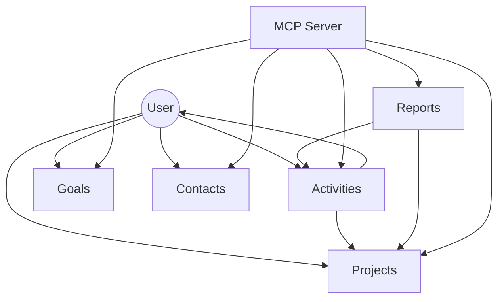

# jobmark Project Memory

## Overview

jobmark is a personal career management platform that allows users to log accomplishments ("activities"), track projects, set goals, and manage professional networks. It connects to the AI assistant the user chooses through MCP (Model Context Protocol).

## Architecture & Tech Stack

- **Framework:** Next.js 16 (App Router)
- **Language:** TypeScript
- **Database:** PostgreSQL via Prisma ORM
- **Auth:** Auth.js (NextAuth) with Google Provider
- **UI:** Tailwind CSS, Radix UI, Framer Motion, Lucide Icons, Recharts (Insights)
- **Review and outreach:** Deterministic, evidence-only briefs are generated in Jobmark. Connected MCP assistants can turn those briefs into richer writing without an external model service in Jobmark.
- **MCP:** Standards-compliant MCP server with OAuth 2.1 provider for external AI clients (Claude, ChatGPT, etc.).
- **Optimization:** Turbopack for fast development and Server-Side Data Aggregation for heavy charts.

## Key Subsystems

### 1. Activity & Project Engine

- **Activities:** The atomic unit of data. Logged via `QuickCapture`.
- **Projects:** Logical groupings for activities. Supports archiving.
- **Stats:** Calculated on the server to avoid client-side waterfalls.

### 2. MCP Server (`/mcp`)

- **Protocol:** JSON-RPC 2.0 over Streamable HTTP.
- **OAuth:** Full OAuth 2.1 provider with PKCE, JWT access tokens, refresh token rotation.
- **Tools:** 50+ domain tools (activities, projects, goals, reports, contacts, outreach, focus, settings, vault, account).
- **Vault:** Per-connection vault lock with secure action URLs for unlock/setup/change-password flows.

### 3. Focus & Decompression (`/focus`)

- **Wizard:** A multi-phase experience (Breathing > Goals > Affirmations).
- **Audio:** Web Audio API for immersive soundscapes.

### 4. Insights & Analytics (`/insights`)

- **Heatmap:** Contribution visualization pre-calculated on the server.
- **Charts:** Weekly trends and project distribution via Recharts.

### 5. Networking (`/network`)

- **Contacts:** CRM-lite for professional relationships.
- **Outreach:** Builds evidence-based outreach plans from contact history.

## Architectural Visualization


```mermaid
graph TD
    User((User)) --> Project[Projects]
    User --> Activity[Activities]
    User --> Goal[Goals]
    User --> Contact[Contacts]

    Activity --> Project
    Activity --> User

    Report[Reports] --> Activity
    Report --> Project

    MCP[MCP Server] --> Activity
    MCP --> Project
    MCP --> Goal
    MCP --> Contact
    MCP --> Report
```

## Core Code Patterns

### 1. Server Session Lifting (Performance)

Avoid calling `auth()` in multiple sub-components. Fetch once at the page level.

```typescript
// Good: Single DB lookup for session
export default async function Page() {
  const session = await auth();
  const userId = session.user.id;

  const [data1, data2] = await Promise.all([getData1(userId), getData2(userId)]);
}
```

### 2. MCP Tool Pattern (Extensibility)

To add a new MCP tool, create a tool definition in `lib/mcp/tools/`.

```typescript
export const newTool = {
  name: 'new_tool' as const,
  inputSchema: { /* Zod schema */ },
  outputSchema: { /* Zod schema */ },
  annotations: { readOnly: true, destructive: false, idempotent: true, openWorld: false },
  async execute(input, actor) {
    // 1. Validate input
    // 2. Call domain function from lib/jobmark/
    // 3. Return structured result
  },
};
```

### 3. Render-Phase State Syncing (Snappiness)

Sync props to local state during render to avoid `useEffect` lag.

```typescript
const [prevProp, setPrevProp] = useState(prop);
if (prop !== prevProp) {
  setLocalState(prop);
  setPrevProp(prop);
}
```

## Development Workflows

### Build & Run

- `npm run dev`: Start with Turbopack (fast).
- `npm run build`: Production build and typecheck.
- `npx prisma studio`: Browse database locally.

### Database Safety (CRITICAL)

- **NEVER run `prisma db push`, `prisma migrate deploy`, or `prisma migrate dev` against production.**
- Always use guards: `npm run db:push` (guarded), `npm run db:migrate:dev` (guarded).
- The guard script (`scripts/guard-db.sh`) blocks production endpoints.
- Production URLs are intentionally blocked by the local guard; production migrations run only from the reviewed release workflow.
- `.env` has production URL (for Vercel deploys). `.env.local` should have dev URL.
- Development branch on Neon: `br-noisy-river-ahq8todh` (endpoint: `ep-orange-field-ahk3riq0`).
- Get dev connection string: `neonctl connection-string <branch-name>`.
- Production branch: `main` (endpoint: `ep-winter-star-ah9jvaa7`).

### Standards & Conventions

- **Naming:** PascalCase for components, camelCase for variables/functions.
- **Performance:** Avoid `setState` in `useEffect` for syncing props; sync during render phase instead.
- **Type Safety:** NO `any` types. Use explicit interfaces or `Record<string, unknown>`.
- **Logic:** Business logic goes in Server Actions (`app/actions/`) or dedicated `lib/` modules.
- **Documentation:** Always explain "Why" in comments. Keep components focused.

## Project History Highlights

- **2026-03-02:** Massive performance optimization. Enabled Turbopack, refactored session waterfalls, and moved heatmap logic to server.
- **2026-03-02:** Standardized debouncing with `lodash.debounce` and resolved `middleware` deprecation by moving to `proxy.ts`.
- **2026-03-02:** Implemented Strategy Pattern for AI context assembly to improve maintainability.
